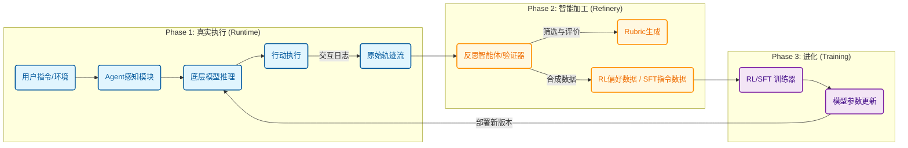

# 前言

我从2023年开始接触大模型，到现在已经是第4个年头了，算是国内首先开始接触并使用大模型的第一批人了。作为一个之前做数据产品的**后端研发工程师**，经历了从大模型入门到深度参与建设的转变，2025年不仅将大模型应用在日常的工作流程中，也有幸参与到大模型的构建、训练数据处理工作中。

在agent元年，也作为自己新的变化的起点，就从这片文章开始介绍下自己在大模型发展上的一些思考，作为自己学习的总结，也希望能够帮助到其他朋友有所收获。

以下内容绝大部分来自于行业大佬的分享，也包括少量作者自己的思考和整理，以飨读者朋友。

# 2025年大模型发展趋势

2025年，大语言模型（LLM）行业经历了前所未有的高速发展与深刻变革。这一年，技术创新、市场竞争和商业化落地以前所未有的速度交织演进，推动AI从实验室走向广泛的生产力工具。从年初的技术范式突破，到年中的激烈市场博弈，再到年底的技术前沿再定义，整个行业呈现出一种加速迭代、多点开花的态势。开源与闭源模型之间的性能差距急剧缩小，各大厂商在模型能力、成本效益和应用生态上展开全方位竞争，共同将大模型技术推向了新的高度。

如果要为2025年设定几个年度关键词来代表这一年大模型发展的重要里程碑，我的答案会是“agent”、“多模态感知”、“范式升级”。

以下是我用gemini+nano banana生成的2025年大模型行业发展的主要趋势概览图示：（可以看出来nana banana在这样信息密度的场景生成的汉字也已经可以很好的辨认清楚了，生成漫画效果更好）

- 从2025年初deepseek发布R1模型开始，RLVR快速替换了之前HFRL，为整个行业打开了通用推理模型的道路。大模型的能力增长范式也从之前的算力scaling law转变为test timing scaling law，通过推理时间的增加获取模型性能的提升。本质区别来说，之前模型的能力完全靠训练时的算力构建，而o1和deepseek的r1之后，模型的性能提升是靠训练算力和推理算力共同来支撑了。记得在openai o1刚刚出来的时候，产业界、学术界还纷纷尝试各种路径进行浮现，其中一个主要方向即是利用蒙特卡洛树搜索的方式逐步搜索推理空间，但是deepseek r1证明了仅通过最终结果+GRPO的方式就足以激发模型自己进行最优路径探索。这可能恰恰说明对于大模型来说，看起来最简单、最平平无奇的方式往往是最有效的。
    - 这里再介绍下清华大学刘知远团队2025.12月发布的论文[《JustRL: Scaling a 1.5B LLM with a Simple RL Recipe》](https://arxiv.org/pdf/2512.16649)，在RL发展1年的当前时间，各种大模型RL技巧层出不穷，但是这篇论文剔除了几乎所有rl训练技巧却使RL训练更加稳定，在这个大家持续雕花的时代，指出了一条似乎被大家忘记了的原则：
        
        > 奥卡姆剃刀原则，如无必要勿增实体
        > 
- 当模型推理能力被解锁后，我们发现agent能力也开始快速发展。claude code发布标志着模型开始从云端环境直接进入个人PC，开始直接接触最真实的用户环境，影响生产力的提效。之后model和agent开始相互影响，不仅仅是model能力的提升让agent更加实用，agent的策略方法已经实际环境遇到的问题也在逐步向model侧迁移，agent的通用技能逐步内化到model中。这里当前最显著的一项内化趋势应该就是关于模型记忆的部分了。从agent概念提出的第一天就包括memory的内容，只是当时memory最主要的场景就是RAG，而今天随着模型上下文工程的发展、应用的个性化需求，大模型memory也逐步与认知心理学领域的记忆概念相对其，同时出现了大量的memory项目，如mem0、memU等等。而最近几个人模型内化记忆的趋势越来越明显，各家都在探索模型记忆的能力增强，这里最具代表的应该就是deepseek最新发布的论文[《Conditional Memory via Scalable Lookup:A New Axis of Sparsity for Large Language Models》](https://www.arxiv.org/pdf/2601.07372)了。而且我坚信未来一定会有越来越多的认知心理学方法应用在大模型训练/使用上。
- 人工智能领域普遍认为数据越多越好,理论上给模型提供图像来补充文本问题应该能提高理解能力。但一项使用[SUPERChem基准测试](https://arxiv.org/pdf/2512.01274)的研究发现,多模态的影响其实挺复杂的,模型在同时处理图像和文本时会表现出三种不同的模式:第一种是真正受益的,比如Gemini 2.5 Pro这样的模型,看到化学结构图后准确率能提升4.7个百分点,说明它确实能有效融合图像和文本信息;第二种是文本主导型的,像GPT-5(High)这种,有没有图像表现都一样好,因为它的文本推理能力已经足够强,仅凭文字描述就能重建空间和结构信息,图像反而显得多余了;第三种比较有意思,是认知干扰型的,比如GPT-4o,给它看图像后性能反而下降了3.8个百分点,视觉数据好像给它增加了认知负担,把推理过程搞得更混乱了。这其实打破了"越多越好"的简单想法,也说明让AI像人类一样真正整合不同感官信息进行推理,仍然是个复杂且没解决的难题。但是2025年我们也看到了多模态模型的潜力以及其在真实世界应用的不可或缺性。Gemini 3的发布展示了多模态大模型在scaling law上的巨大潜力。作为Google最新一代旗舰模型,Gemini 3的显著优势包括:原生多模态理解与跨模态推理能力、支持200万token的超长上下文、在数学/科学/编程等领域接近专用推理模型的性能、优化的实时交互响应速度,以及在大规模模型下实现的优异成本效益比。gemini3的成功让业界看到了多模态大模型的潜力，2026年相信会看到多模态模型更多的进步，也许有一天模型能够充分利用语言、视觉、听觉、甚至触觉、嗅觉用来感知、理解真实的物理世界，并在反馈中不多持续学习，那样可能5年、10年后每个家庭都能够拥有自己的机器人管家。
- 最后我们也在今年看到了李飞飞世界模型的落地，虽然与主流大模型方向不同，但是落地场景却异常的明确，即游戏和电影制作，这也是当前主流大模型要认真思考的问题。除了世界模型，在当前transformer架构下，我们也看到了deepseek在持续探索，优化基础的模型架构以在国内更少的计算资源的限制下与国外顶级大模型相竞争。相信未来大模型架构的升级（基于transformer或者未来更先进的架构）能够让模型消耗更少的算力同时具备内化的持续学习的能力，也许像lly说的，未来的模型应该就像个14-15岁的孩子，能够自己进行学习而不是一次性的训练。这样我们可能就要开始思考机器人伦理问题了，因为如果有一天大模型真的具备了这样的能力，那装备了这样大脑的机器人和真实的我们又有多少区别呢。

## 一、Agent元年：从网页到个人电脑

如果说2024年是Agent概念在全球范围内得以普及和验证的一年，那么2025年则无疑是Agent技术从云端实验走向桌面级生产力工具的“落地元年”。这一进程的标志性事件，无疑是Anthropic在年中发布的**Claude Code**。

Claude Code的划时代意义在于，它标志着大模型首次以“原生Agent”的身份，而非简单的对话助手或代码补全工具，直接“入驻”开发者的集成开发环境（IDE）与操作系统终端。它不再通过API调用或网页插件间接服务，而是获得了对用户本地项目代码库、文件系统、运行进程的直接感知与操作权限。这种从“旁观者”到“协作者”的身份转变，开启了大模型与人类协同工作的新范式。

其带来的变革是深远且多层次的：

1. **开发范式的颠覆：从“辅助编程”到“结对编程”**
传统的代码补全或Copilot类工具，本质上是基于上下文预测的“超级自动完成”。而Claude Code展现的Agent能力，则是理解复杂任务意图、拆解步骤、自主探索解决方案、执行命令并迭代修正的完整闭环。它能根据一段模糊的需求描述（如“为这个微服务添加用户认证功能”），自行查阅项目文档、分析现有架构、编写代码、运行测试、调试错误，甚至通过终端命令部署到测试环境。开发者从逐行编写的“工匠”，更多转变为设定目标、审核方案、把握方向的“架构师”。
2. **真实环境的复杂性与价值**
云端或沙箱环境中的Agent表现，与在布满历史债务、依赖冲突、环境各异的真实个人电脑中工作，完全是两回事。Claude Code必须直面混乱的`node_modules`、晦涩的报错日志、不兼容的系统库以及复杂的命令行工具链。正是在应对这些“脏活累活”的过程中，Agent的鲁棒性、问题诊断能力和工具使用技巧得到了真正的淬炼。这也反向驱动模型训练需要纳入更多关于系统交互、错误处理和工具链理解的真实数据。
3. **Agent与Model的协同进化**
2025年清晰地展示了Agent与底层大模型之间“相辅相成”的飞轮效应。一方面，以DeepSeek-R1、OpenAI o1系列为代表的“推理模型”为Agent提供了强大的思维链和规划能力根基；另一方面，Agent在真实场景中遇到的挑战（如长期任务管理、状态保持、工具学习）又催生出新的模型能力需求。最典型的例子就是**记忆（Memory）的内化趋势**。
早期Agent的记忆严重依赖外部向量数据库（RAG），但这在频繁切换上下文、需要长期个性化交互的桌面场景中显得笨重且低效。2025年，我们看到模型本身开始承担更多记忆功能。从Mem0、MemU等专用记忆项目的兴起，到DeepSeek最新论文《Conditional Memory via Scalable Lookup》探讨的“条件记忆”架构，目标都是将关键的用户偏好、项目上下文、操作历史更高效、更安全地内化于模型之中。这不仅是技术的进步，更是Agent从“通用工具”迈向“个性化伙伴”的关键一步。
4. **生态的裂变与桌面入口的争夺**
Claude Code的成功像一颗投入湖面的石子，激起了巨大的涟漪。各大厂商迅速跟进，争夺“个人AI协作者”这一核心入口。微软将Copilot深度整合进Windows系统内核与PowerShell；苹果的Apple Intelligence以系统级隐私和本地化推理为卖点，悄然嵌入每一台Mac；各路开源Agent框架（如Cursor、Windsurfer、开源仿品）百花齐放，围绕着VSCode、JetBrains全家桶等开发者核心阵地展开激烈竞争。桌面，这个离用户最近、生产力最密集的场景，成为了大模型应用下半场的主战场。

总而言之，2025年的Agent进化，路径清晰地从“网页中的智能体”走向了“电脑中的副驾驶”。它不再是一个需要被“呼唤”的功能，而是时刻在线、洞悉语境、能动手实操的“数字同事”。这不仅是技术能力的跨越，更预示着人机协作关系的一次根本性重塑。当我们习惯于向身边的Agent口述一个宏伟的想法，并看着它将其分解、执行、呈现时，我们自身在创造性生产链中的角色，也正在被重新定义。

## Agent与Model的协同进化：基于执行环境数据收集与优化的工程路径

### 核心理念：将真实环境交互转化为进化燃料

当前，大模型Agent的进化面临一个根本性矛盾：一方面，Agent的能力需要在复杂、开放、动态的真实环境中得到终极检验与提升；另一方面，驱动模型进化的高质量训练数据（尤其是包含“观察-行动-反馈”循环的交互轨迹数据）却极度稀缺，人工标注成本高昂且难以规模化。

基于真实agent执行环境收集整理并反馈训练回模型的方法，本质上是构建一个**数据飞轮**：让Agent在真实环境中执行任务，系统性地捕获其完整的交互轨迹，然后通过智能化的“加工厂”，将这些原始轨迹提炼成两种关键产物：

1. **用于模型训练或微调的强化学习数据**。
2. **用于评估Agent表现优劣的、可量化的评估准则（Rubric）**。

这个过程呼应了AI Agent应具备“持续学习进化”的特征，即能把每一次成功或失败都转化为“经验值”，基于反馈优化其决策模型。

### 工程架构：感知、反思与数据合成的闭环

一个实现该方法的工程系统，可以构建为以下几个核心模块的闭环：

**1. 全域交互轨迹捕获（感知模块增强）**
这是数据收集的基础。Agent的“感知模块”不仅用于理解用户指令和环境状态，更需扩展为一个**全景记录仪**。它需要以结构化的格式（如JSON Schema）记录下每一轮交互的完整上下文：用户原始目标、Agent的内部推理链（Chain-of-Thought）、调用的工具（API、代码解释器等）及其参数、工具执行结果、环境状态变化、最终输出以及用户的显式或隐式反馈。这构成了原始的“代理数据”。

**2. 验证与反思驱动的高价值数据筛选（反馈优化模块的核心）**
并非所有交互轨迹都有同等的训练价值。这里需要引入你提到的 **Verify（验证）** 和 **Reflection（反思）** 机制作为过滤器与放大器。

- **结果验证**：对于有明确正确答案的任务（如数学计算、代码执行），可以通过工具（如代码解释器）自动验证最终结果的正确性。正确和错误的轨迹都极具价值。
- **过程反思**：对于更主观或复杂的任务，可以启动一个“反思智能体”。在任务结束后，让其回顾整个执行过程，评估：结果是否完美达成目标？计划是否高效？哪一步骤最关键或最容易出错？是否存在更好的替代策略？。这种反思日志本身是高质量的数据，同时也能为原始轨迹打上“质量标签”。
- **优势评估（Rubric生成）**：通过对大量反思日志和成功/失败轨迹的归纳分析，系统可以自动总结出区分成功与失败的关键因素，形成初步的、数据驱动的评估准则（Rubric）。例如，在数据分析任务中，Rubric可能包括“是否正确处理了缺失值”、“可视化图表是否清晰传达了核心洞察”等维度。这些Rubric反过来又能指导更精准的反思和筛选。

**3. 轨迹到训练数据的智能合成（决策引擎的进化）**
这是将原始数据“加工”成模型进化养料的关键步骤。借鉴**Agent0**框架中“课程智能体”与“执行智能体”的协同思想，这里可以构建一个**数据合成智能体**。它的任务是将筛选出的高价值轨迹（尤其是那些在能力边界上、通过工具使用解决了复杂问题的轨迹），重新构造成更适合模型学习的格式：

- **RL数据合成**：将成功的轨迹（状态、动作、奖励）序列，以及通过反思发现的“更优路径”与“次优路径”的对比，构造成用于强化学习（如PPO、GRPO）的偏好对或奖励信号。对于模糊的任务，可以采用类似Agent0的**ADPO（歧义动态策略优化）** 算法，根据答案的一致性动态调整学习权重。
- **指令数据合成**：将复杂的多步任务轨迹，提炼成“指令-复杂推理过程-正确输出”的监督微调（SFT）数据，用于提升模型的规划与推理能力。

**4. 模型迭代与闭环验证**
加工好的数据用于对底层大模型进行微调或强化学习训练。更新后的模型再部署到Agent中，进入真实环境开始新一轮的交互。系统需要持续监控关键指标，如任务完成率、工具使用效率、用户满意度等，以验证进化是否有效，并动态调整数据收集和合成的策略。

### 二、世界模型：具备多模态感知能力

回首2025年大模型领域，有一个方向虽未像AGI那般占据所有头条，却以其坚实的工程路径和明确的落地场景，为整个行业展示了另一种可能——那就是由李飞飞团队领衔探索并落地的**世界模型**。

与大语言模型从海量文本中学习“符号世界”的逻辑和知识不同，世界模型的核心在于理解并模拟**物理世界**的动态、规则与状态变化。它处理的输入是视觉、物理信号等多模态感知数据，输出的则是对未来状态的预测或对物理交互结果的仿真。如果说LLM是“文科生”，擅长语言与推理，那么世界模型就是“理科生”或“工程师”，专精于对物理现实的建模。

**落地场景的明确性是其最大特点。** 当通用大模型仍在探索更广阔的商业化应用时，世界模型已迅速在两大领域找到了“杀手级”价值：**游戏制作与电影/动画生成**。

1. **游戏开发革命：从“手工建造”到“物理引擎驱动的内容生成”** 传统的游戏开发中，角色动作、物体交互、环境反馈（如破碎、火焰、液体）需要美术师逐帧制作或依赖预设的物理引擎脚本，耗时耗力且缺乏灵活性与真实感。世界模型引入后，情况彻底改变。开发者可以输入高层的指令（如“角色从三楼破窗跳下，落在雨中的泥地上并翻滚”），世界模型能基于对重力、材质、动量等物理规律的理解，自动生成符合现实物理学、连贯且多样化的动作序列与场景反馈。这不仅极大提升了内容生产效率，更使得游戏内的互动变得无比丰富和真实，为开放世界游戏和沉浸式模拟体验带来了质的飞跃。
2. **影视工业的“虚拟制片”升级** 在电影特效与动画领域，世界模型正在成为下一代“虚拟制片”的核心。它可以快速模拟大规模、复杂的物理场景，如千军万马的战场、洪水淹没城市、星系碰撞等，其逼真度和物理准确性远超传统的粒子系统与流体仿真。更重要的是，它允许导演和创作者进行“语义级”调控（如“让这场爆炸的冲击波更猛烈一些，并卷起更多灰尘”），模型能理解意图并生成相应效果，将创作从繁琐的技术参数调整中解放出来。这大幅降低了顶级视觉特效的门槛与成本，赋予了独立制片人和小型工作室前所未有的创作能力。

**世界模型的成功，也为主流大模型的发展提供了关键启示：**

- **具身智能的必要路径**：要实现真正的通用人工智能（AGI）或能操作物理世界的机器人，仅仅拥有强大的“大脑”（LLM）是不够的，还需要一个能精准理解世界如何运作的“小脑”或“内在模拟器”。世界模型正是填补这一空白的核心组件。未来，LLM负责高层规划与推理，世界模型负责对物理结果进行预测和验证，两者结合才能催生可靠的具身智能体。
- **专用化与工程化的价值**：并非所有AI问题都需要一个参数万亿的通用模型来解决。世界模型展示了在特定领域（物理仿真），通过专注于高质量、高保真的多模态数据训练，可以获得极高的实用价值和商业回报。这条“深度而非广度”的路径，提示业界在追求通用能力的同时，也应深耕能解决实际痛点的垂直化、工程化模型。

展望未来，世界模型与大语言模型的融合将是必然趋势。一个能理解《三体》中“水滴”摧毁舰队的文字描述，并能通过内在世界模型将其视觉化、动态模拟出来的AI，或许才是我们想象中的“完整智能”。李飞飞世界模型的落地，就像在AI宇宙大爆炸中，点亮了关于“物理实在”的那颗星，它的光芒虽不覆盖全部，却为AI触及真实世界锚定了坚实的坐标。

### 三、架构演进：从算力约束到“心智”仿生——认知科学驱动下的范式升级

当全球大模型竞赛进入白热化，一个无法回避的现实愈发凸显：顶尖模型性能的背后，是令人咋舌的算力消耗与训练成本。对于算力基础相对薄弱的中国AI产业而言，单纯追随 Scaling Law 进行“暴力穷举”式的军备竞赛，既不可持续，也难以实现超越。**然而，2025年的架构演进呈现出一个更为深刻的转向：从单纯追求“参数规模”的效率优化，转向借鉴生物智能原理、构建更接近“认知”过程的模型架构。** 以 DeepSeek 为代表的中国力量，正与全球顶尖研究同步，探索一条从微观架构革新到宏观“心智”仿生的新路径。

这一范式升级的核心，不仅是“更聪明”而非“更庞大”，更是从“静态计算图”向“动态、持续、具情境感知的智能体”的演进。其焦点主要集中在以下几个前沿方向：

1. **从条件计算到条件记忆：构建模型的“长期记忆”系统** 传统稠密模型如同一个每次思考都需唤醒全脑的“静态快照”，缺乏持续积累知识的能力。借鉴认知科学中关于记忆系统的划分（如工作记忆、情景记忆、语义记忆），新一代架构开始将“记忆”作为原语（primitive）进行深度内化。DeepSeek 提出的 **Engram（记忆印迹）模块**，是这一方向的典范。它并非简单的外挂向量数据库（RAG），而是将 **条件记忆（Conditional Memory）** 作为与条件计算（MoE）**互补的稀疏化新轴**。通过 O(1) 复杂度的 N-gram 查找，模型能将静态知识（如实体、惯用语）的存储与动态推理的计算在架构层面解耦。这不仅实现了“大模型能力，小模型成本”，更关键的是，它为模型提供了可扩展、可查找的长期记忆基础，使其具备从“一次性成品”向“可成长数字心智”转变的潜力。
2. **智能体与模型架构的协同演进：外挂组件的能力内化** 当前，大模型智能体（Agent）的研发已广泛借鉴认知科学的概念，如感知、决策、记忆等。各种**外挂记忆组件**（如mem0, MemU, Cognee, Letta, Zep等）如雨后春笋般涌现，用于增强Agent的持续学习和情境适应性。一个明确的趋势是，Agent架构中行之有效的设计，正逐步被“内化”到基础模型架构中。例如，Google DeepMind 最近的“Memory through Embedding Label Token”与 DeepSeek 的 Engram 异曲同工，都试图将记忆功能更原生地整合进模型。这种 **“Agent驱动模型演进，模型增强Agent能力”** 的闭环正在形成，推动着模型从单纯的对话工具，向拥有记忆、能持续学习并与环境交互的智能体演进。
3. **超越Transformer：为持续学习与AGI探索新架构基础** 尽管Transformer仍是当前主流，但其作为固定参数“静态快照”的本质，在实现**持续学习、增量知识更新和高效世界模型构建**方面存在根本性局限。认知科学百余年的研究（自1879年冯特建立第一个心理学实验室始）为理解学习、记忆和推理提供了丰富框架。下一代架构探索正积极向此借鉴，目标不仅是提升单次任务性能，更是解决**灾难性遗忘、安全高效地吸收新知识**等核心挑战。这些探索试图将模型从一个训练后固化的“化石”，转变为一个拥有初始心智、能通过交互持续“成长”和“进化”的有机系统。

这些架构层面的探索，其意义远超技术细节本身。它意味着中国AI产业正在尝试 **“换道超车”**——与其在对方制定的游戏规则（纯粹比拼训练算力与数据规模）中追赶，不如重新定义游戏规则，追求在既定算力约束下的极致效率与智能密度。这是一条更具挑战性的道路，但一旦走通，将可能孕育出更适合广泛部署、更个性化、更具可持续性的下一代AI基础模型。

诚然，通往“像人类一样学习与思考”的AI之路依然漫长，架构的每一次演进都只是攀登途中坚实的一步。但当我们回望2025年，会看到在追逐通用智能的星辰大海时，亦有人在潜心锻造更轻便、更坚韧、更智慧的舟楫。这不仅是技术的进步，更是发展哲学的一次深刻映照：真正的强大，不在于拥有的资源之多，而在于利用资源的效率之高与智慧之深。未来，属于那些既能仰望星空，也能脚踏实地优化每一焦耳算力的探索者。

# 2026年，如何拥抱大模型

站在2026年的开端，大模型技术已经从概念验证走向规模化应用的关键节点。对于企业而言，如何有效拥抱这一变革性技术，既是机遇也是挑战。

## C端与B端应用的分化现象

一方面，我们看到越来越多的native AI应用在C端市场蓬勃发展：

- **对话类应用：**豆包、Kimi、通义千问、文心一言等国内产品，以及Claude、ChatGPT等国际产品
- **生产力工具：**Notion AI、Cursor、GitHub Copilot、Gamma等深度集成AI能力的工具
- **创意与设计：**Midjourney、Stable Diffusion、可灵、即梦等AI生成工具
- **垂直领域应用：**秘塔搜索（AI搜索）、通义听悟（会议纪要）、讯飞星火（教育辅导）等
- **智能助手：**豆包AI助手、阿福管家、小爱同学AI版等生活服务类应用

在企业内部，员工也开始在各个生产环节中使用大模型提效：内容创作、代码编写、数据分析、客户服务等场景都能看到AI的身影。

然而另一方面，我们也频繁听到"Agent难以落地"的声音，B端企业级应用的进展远不如C端应用那般顺利。这种巨大反差背后的原因值得深思。

## B端落地困境的根源分析

我认为核心原因在于：**当前大模型在B端的应用，更多还停留在单点的效率提升，而企业真正期望的是将大模型赋能到整个生产决策流程中，实现系统性的生产力跃升，带来可量化的经济效益。**

这里的难点主要体现在以下几个方面：

### 1. Agent系统的非确定性挑战

Agent本质上是一个**非确定性系统**，其行为难以完全预测和控制。要让Agent按照企业要求精准执行，需要解决多个层面的问题：

- **知识注入：**不仅需要将企业的知识文档、规章制度提供给大模型，更需要将**业务SOP、执行流程、决策经验**以结构化或半结构化的形式进行梳理和输入
- **深度理解：**让Agent真正理解业务私域知识，而不仅是表面的关键词匹配或简单检索
- **质量保障：**需要构建一套严谨的**验证（Verify）和反思（Reflection）**机制，用于验证Agent的输出结果，监督执行过程，及时纠偏

### 2. 从单点工具到系统赋能的跨越

企业级应用与C端工具的本质区别在于：

- **C端应用：**解决个人某个具体任务的效率问题，用户可以容忍一定的错误率，并通过多次交互修正
- **B端应用：**需要融入复杂的业务流程，与多个系统打通，错误可能导致严重的业务后果和经济损失

这要求Agent不仅要"能用"，更要"可靠"、"可控"、"可审计"。

### 3. ROI计算与价值证明

企业决策更加理性，需要看到明确的投资回报。然而当前Agent应用面临：

- 前期投入大（数据整理、流程梳理、系统集成）
- 效果难量化（如何衡量决策质量的提升？）
- 风险难评估（Agent失误的代价可能很高）

## 2026年企业拥抱大模型的建议路径

基于以上分析，我认为2026年企业应该采取更加务实和渐进的策略：

### 路径一：从"人机协作"开始，而非完全自动化

- 初期将Agent定位为**辅助决策工具**，而非替代人类的自动化系统
- 在关键决策节点保留人工审核环节
- 逐步积累Agent表现数据，建立信任基础

### 路径二：聚焦高价值、低风险的场景切入

- **高价值场景：**知识检索与问答、报告生成、数据分析辅助、客户服务等
- **低风险场景：**内容初稿生成、邮件回复建议、会议纪要整理等可人工复核的任务
- 避免在早期就将Agent应用于高风险的核心业务决策

### 路径三：构建"知识-流程-反馈"闭环

1. **知识体系建设：**系统梳理和结构化企业知识资产（文档、SOP、案例库）
2. **流程显性化：**将隐性的决策逻辑和经验规则显性化、可编码化
3. **反馈机制：**建立Agent输出的评估体系，持续优化prompt和工作流

### 路径四：重视"AI+人"的能力建设

- 培养员工的**Prompt工程能力**，让业务专家能够更好地"驾驭"AI
- 建立**AI应用的最佳实践库**，沉淀成功经验
- 设置**AI应用负责人**，推动组织层面的AI转型

## 个人如何拥抱大模型时代

对于个人而言，要积极地拥抱大模型时代，真正去实践，深度使用大模型及其相关产品，将大模型融入到自己的日常生活和工作中，拓展自己的能力边界。

未来借助大模型的能力会有更多的**1人公司、超级个体**出现。之前大家都说后面需要的是"会问问题的人"，而具体的执行则可以交给Agent。但我这里想继续探索：**"会问问题"的人应该具备哪些品质呢？**

我认为这个画像可能是：

- **想象力丰富：**能够突破现有框架，提出创新性的问题和解决方案
- **善于思考：**具备批判性思维和系统性思考能力，能够提出有深度的问题
- **经验丰富：**拥有领域知识和实践经验，知道什么问题值得问，如何问得更精准

相反，未来被淘汰的将是**初级的脑力劳动者、偏执行但缺乏全局思考的人**。简单的信息搜集、格式转换、重复性的分析工作，都将被AI高效完成。

## 大模型从业者的能力要求

具体到大模型从业者来说，我觉得一个词非常贴切，叫做**"Research Engineer"（研究型工程师）**。

当前大模型行业中，数据、算法、工程的边界已经越来越模糊。要做好这个事情需要具备：

- **持续学习的能力：**技术迭代极快，需要快速吸收新知识、新范式
- **全栈的工程经验：**从数据处理、模型训练到应用部署，需要具备端到端的实践能力
- **系统工程的思维：**不仅关注单点技术，更要理解整个系统的架构、性能、成本和价值

这种复合型能力的要求，既是挑战，也是机遇。那些能够跨越传统职能边界，将研究洞察力与工程实现能力结合的人才，将在大模型时代获得更大的发展空间。

## 小结

2026年，大模型技术本身的能力已不再是主要瓶颈，真正的挑战在于**如何将技术能力转化为业务价值**。

**对于企业而言**，拥抱大模型不是一蹴而就的革命，而是一个需要耐心的进化过程。成功的关键在于：**找到合适的切入点，建立可验证的价值闭环，在实践中不断迭代优化**。那些能够在2026年建立起"AI+人"协作优势的企业，将在未来的竞争中占据先机。

**对于个人而言**，大模型时代带来的是能力边界的极大拓展。要在这个时代脱颖而出，需要培养想象力、思考力和经验积累，成为"会问问题"的人。同时，要主动将大模型融入日常工作和生活，在实践中提升与AI协作的能力。未来属于那些能够驾驭AI、发挥人机协同优势的超级个体。

# 后记

这篇文章既是我第一篇发布在网络上的文字，也是我尝试与AI共同协作完成的一篇文章，准确的说大部分文字都是AI完成的，我做的只是将我的想法告诉AI。随着新的时代机遇，我也开启了另外一段工作，借着这个机会，我也将持续进行AI协同协作，将自己的思想记录下来，以加深自身对与大模型、agent的理解，也希望能对其他朋友有所帮助。

在此预告下后续的分享内容方向，具体的内容可能是自己的一些想法思考或者业界公开发布的论文方法等：

- 认知科学在大模型/agent上的应用
- 现实agent和rl集成以进行持续学习，提升特定领域agent效果