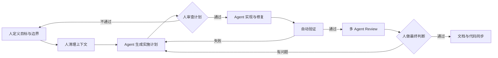
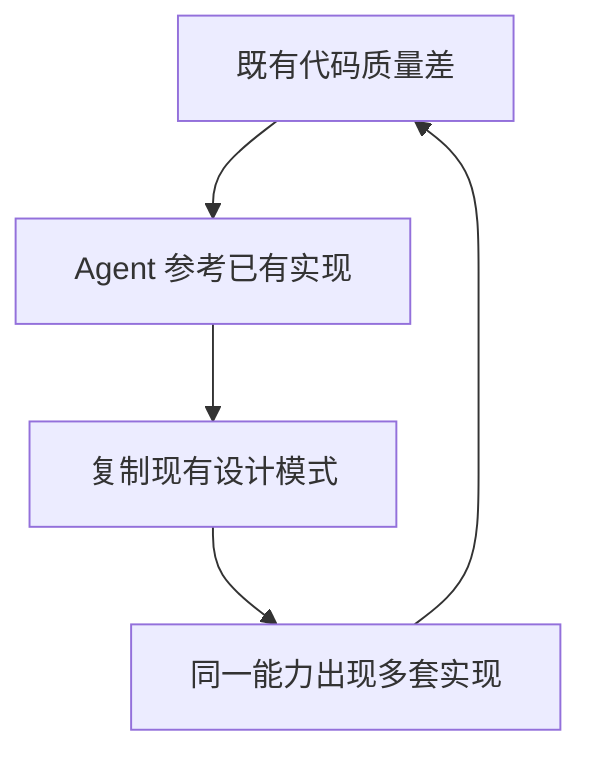

# AI下半场，程序员如何与AI协作

> 先说结论：AI 是放大器。当前 Code Agent 更像一个高速的局部优化器，它能显著提升执行效率，却无法替人完成全局判断和长期责任。程序员不必恐慌，但也不应该把判断权交给模型。

过去几个月，我几乎把主要研发工作都交给了 Code Agent。从写脚本、修问题，到完整开发一个此前从未接触过的 TypeScript Terminal 项目，它带来的效率提升是真实的。但也是在这几个月里，我第一次强烈感受到另一种风险：我们可能正在用更快的速度，生产更多没有人真正理解的东西。

这篇文章不想讨论“程序员会不会被取代”这种没有答案的问题。我更想回答的是：在当前模型能力和训练范式下，程序员应该把什么交给 Agent，什么必须留给自己。

## 一、我为什么不再焦虑

我从 2023 年开始接触大模型，之前主要做数据产品方向的后端研发。后来我逐渐参与大模型预训练、后训练、LoRA 训练、训练数据处理、数据评测和 Agent 开发，也把大模型应用到了日常工作流中。这条路径我在《2025 大模型发展回顾暨 2026 年展望》里有较完整的记录。

真正让我感觉到开发方式发生变化的，是今年春节之后。在我的使用体验里，Claude Sonnet 4.6 之后，Code Agent 第一次开始有能力处理较大的项目，而不再只是生成局部代码和临时脚本。这个变化不是某一天突然发生的，而是一个逐步增强的过程：先用模型理解代码，再让它修改局部模块，最后把整个项目交给它研发，甚至让部分需求和研发自主完成。

比较有代表性的案例有两个。

第一个是爬虫 skill。我让 Agent 先理解已有项目中的类似实现，提取可以复用的模式，再在新项目中生成新的能力。整个过程大约用了 1 周。

第二个是一个 Terminal 形态的 AI 知识生成项目。在此之前，我完全没有 TypeScript 和 Terminal 开发经验，但借助 Agent 的调研、方案参考、模块拆解和测试验证，大约 2 周完成了主要功能。这个过程还使用了 OpenSpec、Superpowers、SpecKit 等研发 skill，并沿用了 TDD 的思路。

这两个案例让我确认了一件事：AI 在程序设计领域的提效已经是不争的事实。问题不在于要不要用 AI，而在于我们如何理解它的能力边界。

## 二、Code Agent 擅长局部，不擅长全局

我对当前 Code Agent 的判断是：它很擅长在明确的框架里工作，却不擅长决定框架本身是否正确。

它擅长的事情包括模式复用、代码生成、局部重构、测试补全、依赖已有经验解决相似问题，以及在成功标准清楚时快速完成闭环。你给它一个边界明确的任务，它往往能给出超出预期的执行效率。

它不擅长的事情也很明确：跨模块影响评估、全局架构设计、系统性重构、长期技术债权衡、性能瓶颈定位，以及对未来方向的判断。它可以告诉你某段代码怎么改，却很难替你回答“这个系统三年后应该长什么样”。

这种边界并不神秘，它和当前的训练方式有关。

RLVR 这类训练范式更擅长处理确定性高、结果容易验证的任务。代码是否正确可以通过测试验证，工具是否调用成功可以从环境反馈中确认，这些都是模型容易学习并获得奖励的场景。但代码质量、架构合理性、可维护性和长期演化这些问题，很难写出稳定、可量化的 rubric。

更困难的是性能问题。许多性能缺陷依赖具体的并发、数据规模、机器环境和调用链路，很难在训练场景中稳定复现。一个无法稳定复现的问题，也很难成为有效的训练数据。

至于当前比较热门的自进化方向，我看到的更多还是规则沉淀、经验文本和 harness 建设。它们能改善 Agent 在特定环境中的表现，但距离“把工程经验真正内化进模型”还有很长的路。

所以，模型能力当然还会继续提升，但至少在当前阶段，它不是一个可以无限扩大的变量。相比继续等待模型自动解决所有问题，工程能力、产品能力和人的判断能力，反而是现阶段更现实的变量。

## 三、一次多人 vibe coding 的失败

让我真正警觉的，不是一个失败案例，而是一次持续数月的多人协作。

那是一个 RAG 项目，项目常驻研发大约 4 到 5 人，另外还有约 5 人不定时提交代码。我主要负责 RAG 数据解析、内容质量和项目推进。项目推进速度很快，功能也在不断增加，团队几乎默认接受了 vibe coding 的方式：先让 Agent 写，能跑就继续叠加。

问题在项目上线后逐渐暴露出来。应用层之间的数据库操作没有事务，导致连接泄漏；一些本该放在数据库或专门存储中的业务数据，被大量放进 Redis；模块之间看似能独立运行，组合起来却频繁出现边界问题。最终，系统不仅需要返工，还影响了其他系统，团队假期加班修复。

这段经历让我意识到，问题不只是“某次代码写得不好”。真正的问题有三个。

第一，我自己没有把目标和边界想清楚。需求是模糊的，架构约束是缺失的，Agent 只能根据不完整的信息快速执行。它不会因为输入模糊而停下来思考，反而会把模糊执行成看起来很完整的结果。

第二，多人协作放大了这种问题。每个人都在让 Agent 加速，却没有人负责统一的目标、接口、数据边界和验收标准。代码在持续增加，系统理解却在持续下降。每个人都能解释自己负责的一小块，却没有人能完整解释系统为什么变成现在这样。

第三，Agent 会主动模仿代码库里已经存在的设计。它不会天然区分“现有实现”和“正确范式”，而是倾向于延续当前项目里的命名、分层、错误处理和数据访问方式。如果既有代码质量堪忧，反复 vibe coding 不仅不会自我修复，反而会把原有的坏习惯复制到更多地方。更糟的是，同一个能力如果出现多套实现，Agent 会把这些分叉都当成可参考的样本，继续生成第三套、第四套。代码腐化因此不再是线性增长，而会以近似复利的方式加速。

所以那次失败不是因为用了 AI。AI 做的事情更准确地说，是把原本就存在的认知缺口和协作问题，以更快的速度放大出来。

## 四、返工之后，我的协作方式改变了

那次返工之后，我没有减少 Agent 的使用，而是重新划定了人与模型的位置：人负责定义问题、设定边界和做最终判断，Agent 负责在边界内快速执行、验证和修复。

现在我更愿意把协作看成一条闭环，而不是一串提示词。每一步都有明确的输入、输出和可以叫停的位置。

第一件事是先把问题想清楚。一个模糊的需求交给 Agent，得到的通常不是正确答案，而是一个更精致、更完整的模糊实现。因此我会先明确目标、边界和验收标准，再让 Agent 生成具体实现；面对不熟悉的领域，也会先调研业界方案和相似项目，再把这些上下文交给它参考。前面爬虫 skill 和 Terminal 项目进展较快，很大程度上不是因为模型自己知道所有事情，而是因为前期提供了足够的参考。

第二件事是清理上下文，而不是继续堆叠功能。Agent 的输出质量高度依赖它看到的代码、文档和历史约束，一个充满歧义、冗余和临时实现的代码库，会让模型不断复现旧问题。返工之后，我开始先优化现有代码质量，消除不必要的抽象，统一数据边界和错误处理方式。给 Agent 一个干净的上下文，比事后要求它写出高质量代码更有效。

更重要的是，同一个能力如果保留多套实现，Agent 不会自动判断哪一套更合理，而会把这些分叉全部当成可参考的样本。这样一来，坏设计不仅会被复制，还会获得更多模仿路径。

第三件事是让 Plan 先给人看。我要求 Agent 的计划尽量精简，尽早说明重点变更、影响范围和变更原因，并尽量使用流程图描述过程。一句话，Plan 首先是给人读的，其次才是给 Agent 执行的。这个改变看似只是文档格式，实际影响很大：人只有先看懂计划，才能在 Agent 开始写代码之前发现问题，而不是等系统上线后再从故障里反推设计。

第四件事是把验证变成默认路径。验证不能依赖人的记忆和责任心，它必须成为工程流程的一部分。在我的主要项目里，我首先打磨了一套部署验证 skill，把测试、检查和部署验证连接起来。后续开发即使主要由 Agent 完成，也必须经过这套流程。复杂项目里，我还会同时运行多个 review agent，分别检查实现、边界、质量和潜在风险。它们能发现很多人工容易忽略的问题，但最终判断不能交给 review agent。多个 Agent 给出的一致意见，不是正确性的证明，只是值得人工进一步确认的信号。

这些实践和我在[《我对 harness 的理解》](./2026-06-08-我对harness的理解.md)里总结的很多原则是一致的：控制概率、管理上下文、明确边界、建立反馈。只是现在我会补上一句更冷的提醒：这些原则本身也有成本，越是依赖 Agent，对人的定义能力和验证能力要求越高。

最后是让文档和代码一起演进。我开始参考 DeepSeek harness 的文档化方式，为每次功能记录意图、说明和变更原因，让文档和代码保持同步。这不是为了留下更多文档，而是为了让 Agent 能理解“为什么这样做”。只有代码、没有意图，Agent 只能模仿结果；只有文档、没有代码，人和模型又无法验证结果。两者同步，协作才有稳定的上下文。

这套方式并不新鲜。它真正改变的地方，是把过去散落在个人经验里的判断，变成协作流程中必须经过的节点。Agent 可以在节点之间高速运行，但节点本身仍然由人负责。

## 五、不同角色应该关注什么

我不认为所有程序员都需要做同样的转变。不同阶段的人，面对 Agent 时的重点并不一样。

| 角色 | 最应该投入的方向 | 最容易犯的错误 |
| --- | --- | --- |
| 初级程序员 | 用 Agent 加快学习，但必须能解释、修改和验证它的输出 | 把模型会当成自己会，跳过基础能力 |
| 资深工程师 | 系统边界、架构约束、质量闸门、验证基础设施和复杂问题判断 | 把自己降级成 Agent 的调度员 |
| 技术管理者 | 建立质量机制、文档同步、风险边界和可验证的交付流程 | 把生成速度误认为交付能力 |

对初级程序员来说，现在确实是一个很好的学习时代。Agent 可以帮你快速阅读陌生代码、理解概念、搭建最小验证环境，也可以把你从重复劳动中解放出来。但前提是你要沉下心。模型会并不等于你会，能够解释、修改和验证，才算真正掌握。

对资深工程师来说，价值不会消失，只会更集中。系统优化、跨模块重构、技术方向和产品取舍，仍然是 Agent 最难独立完成的部分。你需要从“写更多代码”转向“定义更准确的问题，设计更可靠的边界，并为结果负责”。

对技术管理者来说，最危险的指标是表面的生成速度。如果团队没有统一的上下文、质量标准和验收机制，Agent 只会让错误更快地进入系统。真正应该投资的是代码健康、文档同步、验证基础设施和风险边界。

## 六、不要被速度带走

当前关于 AI 的讨论里，有两种声音都很响亮。一种认为程序员很快会被取代，另一种认为只要学会提问，每个人都能成为超级个体。

这两种说法都过度简化了现实。

从我的实践看，Code Agent 确实改变了研发方式，但它没有改变软件工程的基本规律。好的系统仍然需要清晰的目标、稳定的边界、可靠的验证和长期的责任。模型可以加速实现，却不能替你决定应该实现什么，也不能替你承担错误决策的后果。

这几个月里，我完成的项目可能比之前两年还多，但我的成长感却不如一年前。这个反差很重要。它提醒我，生产速度和能力成长不是一回事。如果一个人只是不断接受 Agent 的结果，却没有真正理解背后的系统、数据和工程约束，那么产出越多，能力空心化的风险可能越大。

我不担心 AI 取代程序员。我更担心的是，团队和个人在追求速度的过程中，主动放弃了思考。

Code Agent 可以成为一个很好的协作者，但它首先是一面放大器。输入是混乱，它就会放大混乱；输入是清晰的判断、稳定的边界和严格的验证，它才会放大能力。

AI 下半场真正稀缺的，不是更熟练的 Prompt，而是问题定义能力、工程判断力、产品理解力和对结果负责的能力。
